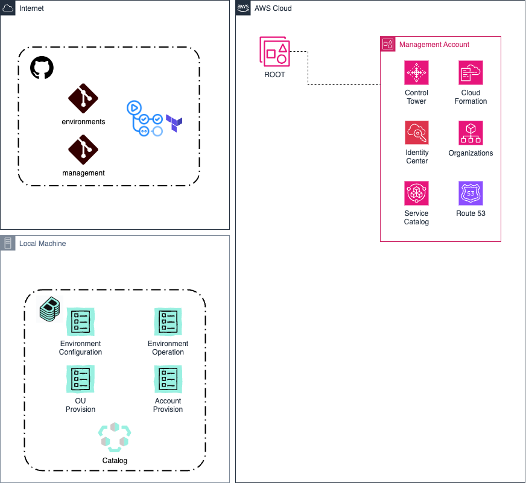
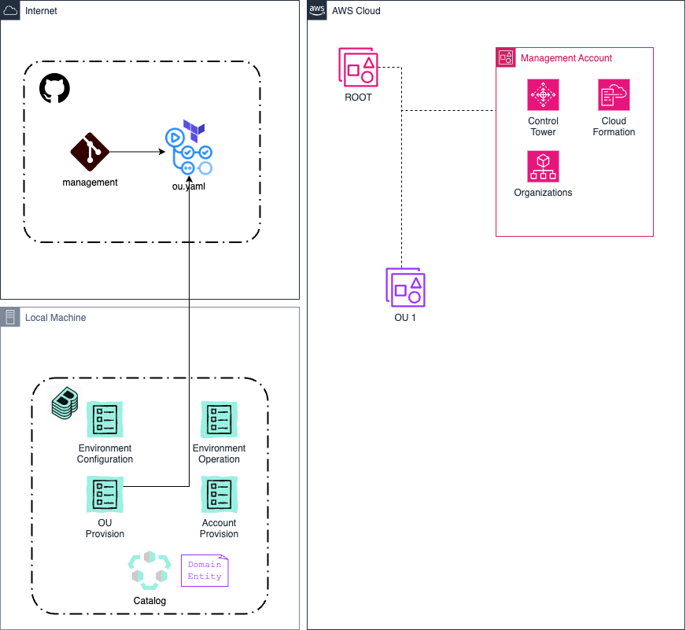
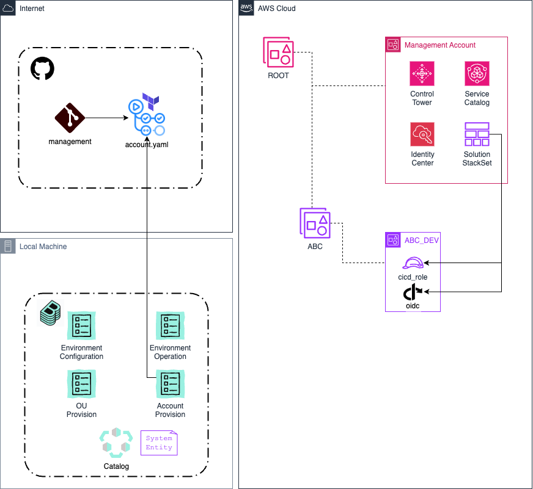

# Automated Control Tower managed OU and account provisioning
This repo provides an example solution enabling the provisioning of Control Tower-integrated AWS OUs and accounts via GitHub Actions. 
The main focus of this repo is the OU and account vending automation.  
To see more details about the Backstage integration or the automated resource provisioning, see the repo [aws_environments](https://github.com/tamer84/aws_environments).

## Solution overview
  

The solution is split across two GitHub repos: 
* [aws_management](https://github.com/tamer84/aws_management) (the repo you are currently in)
* [aws_environments](https://github.com/tamer84/aws_environments)

Both repos have GitHUb actions which use Terraform to automate OU/account creation and resource provisioning.  
Detailed explanations are available in the relevant sections in the README files.   

The solution uses the following AWS Services: 
* [AWS Control Tower](https://aws.amazon.com/controltower/) managed OUs and accounts keep the AWS usage centrally governed and compliant.
* [AWS Organizations](https://aws.amazon.com/organizations/) to keep access, costs and management of Workload accounts restricted.
* [AWS Service Catalog](https://aws.amazon.com/servicecatalog/) to [programmatically provision AWS accounts](https://www.youtube.com/watch?v=LxxQTPdSFgw).
* [AWS CloudFormation](https://aws.amazon.com/cloudformation/) StackSets to inject continuous integration and continuous delivery (CI/CD) roles into newly provisioned accounts.
* [AWS IAM Identity Center](https://aws.amazon.com/iam/identity-center/) to automatically assign user groups to newly provisioned accounts.
* [Amazon Route 53](https://aws.amazon.com/route53/) to delegate DNS from the Zone Apex account to newly vended accounts (Optional).

As part of the initial setup, the Management account requires an IAMRole and setup of GitHub as a trusted OIDC provider.  
This is described below in [Management resources setup](#management-resources-setup).

## Getting started
With Terraform and the aws-cli included in the [ubuntu-2204](https://github.com/actions/runner-images/blob/releases/ubuntu24/20241117/images/ubuntu/Ubuntu2204-Readme.md) GitHub image, only an AWS account is required to proceed.
Fork this repo and follow the steps below to use it in your own AWS management account.
All you need outside of this repo is an AWS account with an IAMUser/IAMRole with the [AdministratorAccess managed policy](https://docs.aws.amazon.com/aws-managed-policy/latest/reference/AdministratorAccess.html) attached.

### AWS setup
The repo is designed to work in a Control Tower managed AWS setup.  
The first step would be to [enable Control Tower in your management account](https://docs.aws.amazon.com/controltower/latest/userguide/setting-up.html).

The solution uses CloudFormation StackSets to inject the IAM roles necessary for further automation.  
The second step therefore, is to [enable Cloud Formation trusted access for AWS Organizations](https://docs.aws.amazon.com/AWSCloudFormation/latest/UserGuide/stacksets-orgs-activate-trusted-access.html).

Optionally, a Route53 Hosted Zone can be used to allow DNS Delegation to be performed into the newly created accounts.  
For this the account would need a Route53 Hosted Zone configured.  
If you want to skip the Route53 step then comment out [account_resources/dns.tf](account_resources/dns.tf).  


### Terraform setup
Directory [_terraform](_terraform) contains a simple declaration to provision an S3 bucket and DynamodDB lock table for Terraform.  
The [S3 Bucket](_terraform/main.tf#10) it creates is shared between the Terraform projects, [management_resources](management_resources), [ou_resources](ou_resources) and [account_resources](account_resources).  
A [partial backend](https://developer.hashicorp.com/terraform/language/backend#partial-configuration) file is also [generated](_terraform/backend_remote.tf), and used in the three above-mentioned repos, with independent keys.  

This should be applied once by an account user with permissions to assume the AWSAdministratorAccess role.  
The default workspace can be used.  

### Management resources setup
Contains the resources to enable the automation within the **central management account**.
GitHub is [configured as an OpenID Connect (OIDC) Provider](management_resources/oidc.tf), to avoid storage of AWS credentials.
The IAMRole [cicd_role](management_resources/iam.tf#13) grants permissions for Control Tower, Service Catalog, and other automation needs.
Finally, the IAMRole [cicd_role] is added as a principal to the [service catalog Control Tower portfolio](management_resources/servicecatalog.tf#10).


This should be applied once by an account user with permissions to assume the AWSAdministratorAccess role.  
The default workspace can be used.

## Backstage Setup
### Backstage Install
Backstage sources are not part of this repo, and detailed setup instructions are also not provided.  
If you want to industrialize the setup after trying it out, there are deployment instructions available at the [official Backstage documentation](https://backstage.io/docs/deployment/).

For this simple example, it's enough to launch Backstage locally.  
Just follow the [getting-started](https://backstage.io/docs/getting-started/) instructions provided by Backstage to get the sources.  
Before you start Backstage continue with the configuration here.  

### Backstage Configuration
This setup requires [GitHub actions to be installed](https://backstage.io/docs/features/software-templates/builtin-actions/), so that the GitHub MR can be created.

From backstage root dir call:  
`yarn --cwd packages/backend add @backstage/plugin-scaffolder-backend-module-github`

and add to `/packages/backend/src/index.ts`:  
`backend.add(import('@backstage/plugin-scaffolder-backend-module-github'));`

#### GitHub access token
To be able to discover the Catalog Entities from GitHub (and to trigger the eventual MR), Backstage requires a Token with the scopes (repo, workflow) for GitHub.  
For this simple scenario, it is enough to [create a PAT](https://docs.github.com/en/authentication/keeping-your-account-and-data-secure/managing-your-personal-access-tokens#creating-a-personal-access-token-classic) and set it as an environment variable (GITHUB_TOKEN).

#### Management account configuration
There is a special [catalog entry for the management account](.backstage/management/management.yaml), so that the automation knows where Control Tower and the root OU are.  
Update the contents of the file to correctly reflect your management account ID and root OU.  

#### app-config.yaml
Finally, copy over the [example app-config.yaml](.backstage_config/app-config.yaml) from this repo.

````
catalog:
  orphanStrategy: delete
  processingInterval: { minutes: 3 }
  import:
    entityFilename: catalog-info.yaml
    pullRequestBranchName: backstage-integration
  rules:
    - allow: [Component, System, API, Resource, Location, Domain, Template]
  locations:
    - type: url
      target: https://github.com/<<YOUR_GITHUB_ORG>>/aws_management/blob/main/catalog-info.yaml
    - type: url
      target: https://github.com/<<YOUR_GITHUB_ORG>>/aws_environments/blob/main/catalog-info.yaml
````
Make sure you modify the catalog location URLs to point to your own GitHub clones/forks of these repos.

### Launch Backstage
Its time to [start Backstage](https://backstage.io/docs/getting-started/#2-run-the-backstage-app).
````
cd my-backstage-app # your app name
yarn dev
````

## Backstage catalog
If everything has gone to plan, you should see Backstage starting up and available on your [localhost](http://localhost:3000/catalog) with two entries in the catalog, AWS Management and AWS Environments.
To understand what the Catalog is, please check the [Backstage documentation](https://backstage.io/docs/features/software-catalog/).

### Ecosystem Model
The OUs and accounts created in the management repo are represented in the Backstage Catalog based on the [Backstage System Model](https://backstage.io/docs/features/software-catalog/system-model).

#### Domains
Any OU you create in AWS via Backstage will have a catalog entry here.

#### Systems
Any account you create in AWS via Backstage will have a catalog entry here.

#### Templates
There are four templates ready to use in the two repositories.

**OU and Account automation**  
Part of this repo and used to provision new OUs and accounts.  
* [AWS OU Provision](.backstage/templates/aws-account-provision.yaml) 
* [AWS Account Provision](.backstage/templates/aws-ou-operation.yaml)

**Environment automation**  
Part of the [aws_environments repository](https://github.com/tamer84/aws_environments), and will be described in detail in that repositories [README.md]()https://github.com/tamer84/aws_environments/README.md).  
* [AWS Environment Configuration](https://github.com/tamer84/aws_environments/blob/main/.backstage/templates/aws-environment-configuration.yaml)
* [AWS Environment Operation](https://github.com/tamer84/aws_environments/blob/main/.backstage/templates/aws-environment-operation.yaml)


## Usage
Interacting with the example is via Backstage Templates, which trigger [GitHub Actions](https://github.com/features/actions).  
The templates can be accessed in the local running instance of [Backstage](http://localhost:3000/create?filters%5Bkind%5D=template&filters%5Buser%5D=all&limit=20).

## Workflows
The two workflows (OU and account) are defined in the [.github/workflows](.github/workflows) directory.  

Each workflow requires [input variables](https://docs.github.com/en/actions/writing-workflows/workflow-syntax-for-github-actions#onworkflow_dispatchinputs), which are in turn passed to terraform as variables for the provisioning.  
Before Terraform can be executed, the Runner needs to assume the [cicd_role defined in management_resources](management_resources/iam.tf#13).  
For this the GitHub action [aws-actions/configure-aws-credentials](https://github.com/aws-actions/configure-aws-credentials) is used as follows:  

````
    - name: configure aws credentials
    uses: aws-actions/configure-aws-credentials@v4.0.2
    with:
        role-to-assume: arn:aws:iam::${{ env.ACCOUNT }}:role/service-role/cicd_role
        role-session-name: GitHub_to_AWS_via_FederatedOIDC
        aws-region: ${{ env.AWS_REGION }}
````

The role is confirmed using AWS STS:  

````
    - name: Sts GetCallerIdentity
    run: |
      aws sts get-caller-identity
````

Once the IAMRole is assumed terraform can be executed, for example the [account](.github/workflows/account.yml#59):  

````
    - name: Create new Account via Terraform
    run: |
      cd account_resources
      terraform init -backend-config=../_terraform/remote_backend.hcl
      terraform workspace select -or-create $OU-$ENVIRONMENT
      terraform apply --auto-approve -var parent_ou_id=$OU -var domain=$DOMAIN -var environment=$ENVIRONMENT -var sso_email=$OWNER
````

## Control Tower OU and account Terraform projects
The logic in these two directories is based on the AWS YouTube video [Programmatically Create an AWS Account with AWS Control Tower | Amazon Web Services
](https://www.youtube.com/watch?v=LxxQTPdSFgw).  

### ou_resources
Responsible for creating new Control Tower managed OUs.  
  

* User launches the [AWS OU Provision template](http://localhost:3000/create/templates/default/aws-ou-provision). 
* Backstage triggers the [ou.yaml workflow](.github/workflows/ou.yml).
* The new OU is created
* Backstage Catalog is [updated](#backstage-catalog-entries)

#### ou.tf
An OU is provisioned using the Terraform resource [aws_organizations_organizational_unit](https://registry.terraform.io/providers/hashicorp/aws/latest/docs/resources/organizations_organizational_unit).  
The provisioned OU is not by default under Control Tower management, it needs to be explicitly brought under management.  
For this, a Terraform [null_resource](https://registry.terraform.io/providers/hashicorp/null/latest/docs/resources/resource) resource is declared, to allow usage of [aws-cli](https://aws.amazon.com/cli/).  

#### stackset.tf
The accounts vended later within this new OU will be automatically injected with an IAMRole/IAMRolePolicy to allow automated environment provisioning.  
This is achieved by creating a [CloudFormation StackSet](https://docs.aws.amazon.com/AWSCloudFormation/latest/UserGuide/what-is-cfnstacksets.html) and setting it to [auto deploy](https://docs.aws.amazon.com/AWSCloudFormation/latest/UserGuide/stacksets-orgs-manage-auto-deployment.html) to new accounts within the OU.  
The StackSet contains the IAMRole and configures GitHub as a trusted OIDC provider.   

### account_resources
Responsible for creating new Control Tower managed accounts within managed OUs.  
 

* User launches the [AWS Account Provision template](http://localhost:3000/create/templates/default/aws-account-provision).
* Backstage triggers the [account.yaml workflow](.github/workflows/account.yml).
* The new account is created
* The StackSet injects the IAMRole and configures GitHub as an OIDC provider 
* Backstage Catalog is [updated](#backstage-catalog-entries)

#### account.tf
An account is provisioned using the Terraform [null_resource](https://registry.terraform.io/providers/hashicorp/null/latest/docs/resources/resource) resource, to allow usage of [aws-cli servicecatalog commands](https://awscli.amazonaws.com/v2/documentation/api/latest/reference/servicecatalog/provision-product.html).  
Details about the process can be seen at [the linked YouTube video](https://www.youtube.com/watch?v=LxxQTPdSFgw).  

#### dns.tf
Optionally, [dns.tf](account_resources/dns.tf) creates a dynamic DNS entry for the new account.
This is supported if there is a Route53 Hosted Zone in the management account.  
It should be commented out if your test AWS Management account does not include a DNS Hosted Zone.  

#### account_alias.tf
To demonstrate provisioning resources in the newly vended account using the IAMRole injected via the [OU StackSet](ou_resources/stackset.tf), the account-alias is set.  

````
resource "aws_iam_account_alias" "alias" {
  provider      = aws.workload
  account_alias = "${local.ou_name}-${terraform.workspace}-${data.aws_caller_identity.current.account_id}"
}
````

Notice the provider is specified as *aws.workload*.  

This is defined in the [providers.tf](account_resources/providers.tf) file as follows:

````
provider "aws" {
  region = var.region
  alias  = "workload"
  assume_role {
    # The role ARN for CICD
    role_arn = "arn:aws:iam::${data.external.get_account_id.result.Id}:role/service-role/cicd_role"
  }
  default_tags {
    tags = {
      Terraform = "true"
    }
  }
}
````

The alias is created by assuming the IAMRole cicd_role within the newly provisioned account.  

### Backstage catalog entries
For each provisioned OU or account, Terraform generates a [Backstage Catalog Entity](https://backstage.io/docs/features/software-catalog/descriptor-format/) file.  
The files are committed by the GitHub action at the end of a successful run into the [.backstage directory](.backstage).

At the root of the repo is a file called [catalog-info.yaml](catalog-info.yaml), which contains a Backstage Entity of type [Location](https://backstage.io/docs/features/software-catalog/descriptor-format/#kind-location):
````
    apiVersion: backstage.io/v1alpha1
    kind: Location
    metadata:
      name: iac-management-files
      description: IAC systems collection
    spec:
      targets:
        - .backstage/*/*.yaml
````
This tells Backstage to scan the [.backstage directory](.backstage) for Catalog Entities.

## Next steps
Now that Control Tower OUs and accounts can be provisioned via GutHub actions, it's time to provision resources into the accounts via Backstage.  
Go see the repo [aws_environments](https://github.com/tamer84/aws_environments) to learn how to configure resources for environments.
